# Linux System Administration Project: Secure Multi-User Server

## Project Overview

This repository documents the setup and configuration of a secure, multi-user Linux server environment. The project simulates real-world system administration tasks, utilizing **CentOS Stream 9** as the server and **Ubuntu** as the client. It covers essential skills in user management, SSH security, file permissions, network firewalling, web server deployment, and system monitoring.

### Project Details

* **Project Duration:** 2-3 days
* **Team Size:** 2-3 members

### Team Members

* Cherish Gohee
* Rosemarie Mahinay
* Rex Sumalinog

## Objectives

* Configure a CentOS 9 server for multi-user access.
* Establish secure SSH access from an Ubuntu client.
* Implement robust user and group management policies.
* Configure file permissions and shared directories for secure collaboration.
* Set up `firewalld` rules to control network traffic.
* Deploy and configure a basic web server.
* Create automated monitoring scripts for CPU and memory usage, with logging and status reporting.

---

## Implemented Tasks and Detailed Configuration

Each section below details the objective, configuration, and the exact commands executed, complete with descriptions and visual demonstrations (GIFs).

### 1. User and Group Management

Set up user accounts (`adminuser`, `devuser`, `guestuser`) and the `developers` group. `adminuser` is granted sudo privileges, and `devuser` is added to `developers`.

**Commands Executed (on CentOS Server):**
> **1.1. Create Users**
> *Description:* Create system user accounts.
> 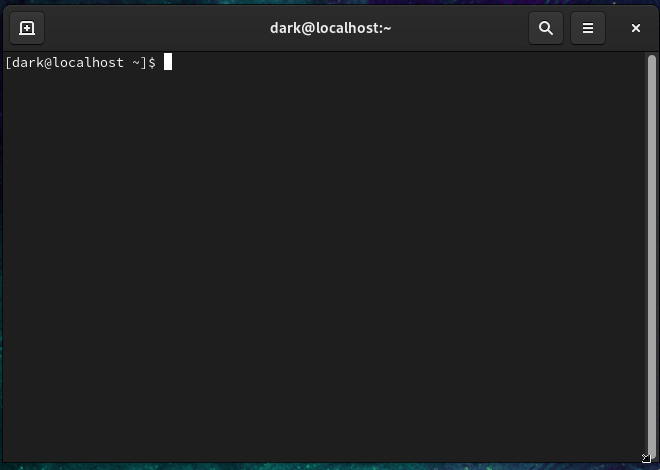
> > *Description:* Also create the accounts on the client side.
> 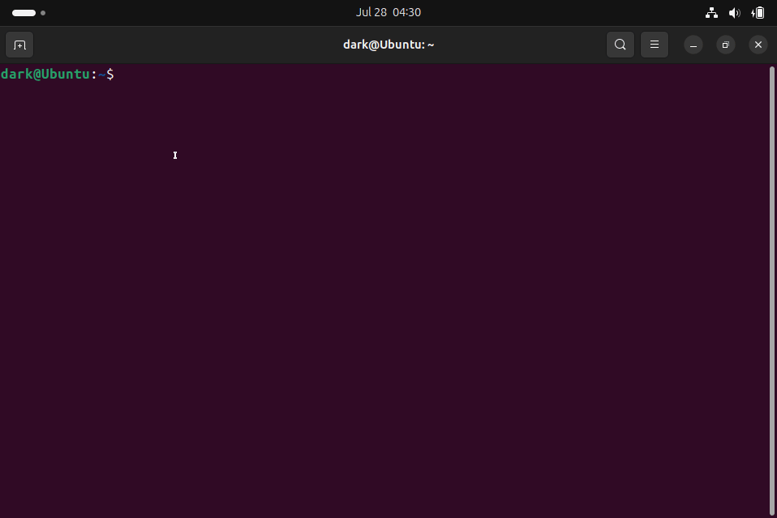
>
> **1.2. Set Passwords for Users**
> *Description:* Assign initial passwords for users.
> 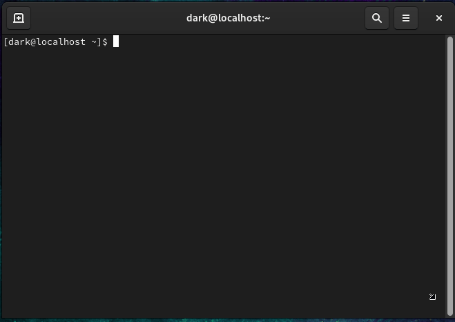
> 
> **1.3. Create Group and Assign Users**
> *Description:* Create `developers` group; assign `devuser` to `developers` and `adminuser` to `wheel` (sudo).
>
> 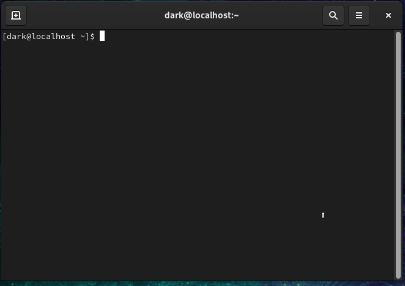
> 
> **1.4. Verify User and Group Assignments**
> *Description:* Confirm user IDs and group memberships.
> 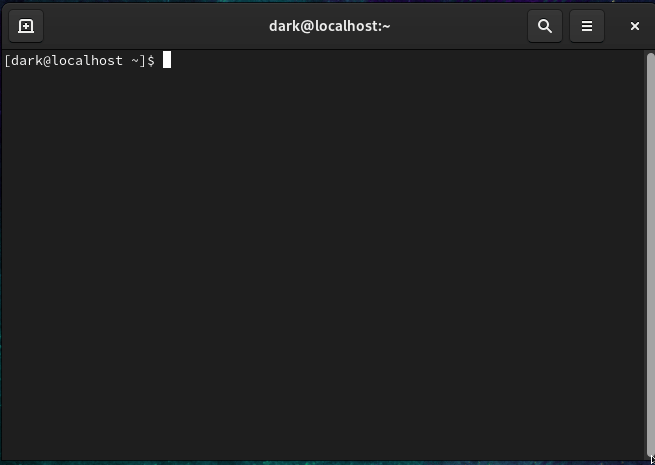

---

### 2. Password Policies

Enforce password expiration and warning periods for all user accounts. Passwords expire every 60 days, with a 14-day warning.

**Commands Executed (on CentOS Server):**
> **2.1. Set Password Expiration and Warning**
> *Description:* Configure password maximum age and warning period for users.
> 
> 
> **2.2. Verify Password Policies**
> *Description:* Confirm the applied password aging information.
> 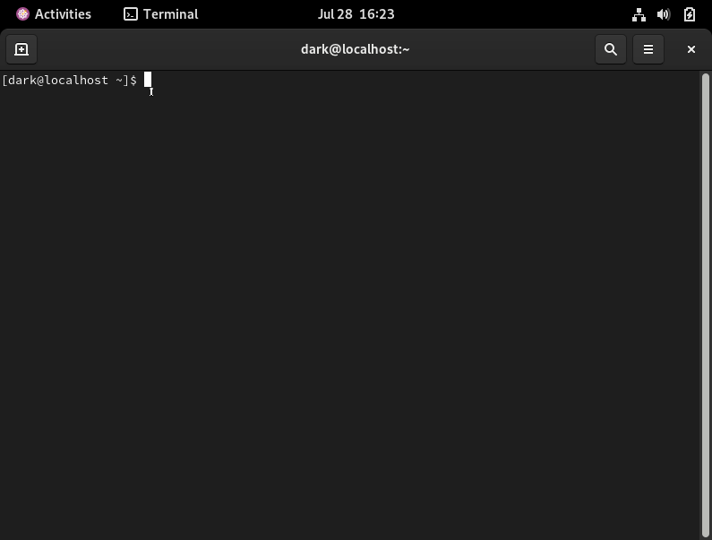
> > *Description:* You can also set password policies for newly created accounts.
> 

---

### 3. Shared Directory Configuration

Create a shared directory (`/srv/devshare`) for the `developers` group with read/write access and `setgid` enabled. `guestuser` is granted read-only access via ACLs.

**Commands Executed (on CentOS Server):**
> **3.1. Create Directory and Set Ownership**
> *Description:* Create the shared directory and assign `root:developers` ownership.
> 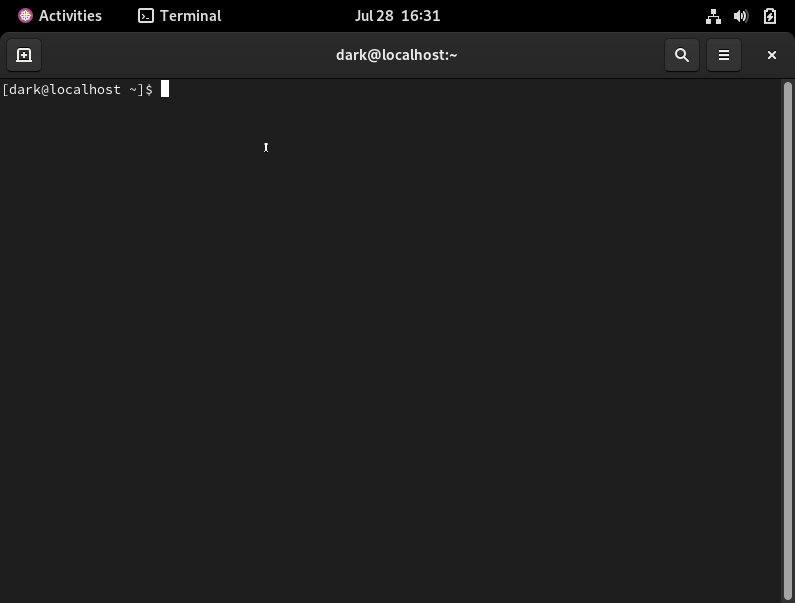
> 
> **3.2. Set Permissions with `setgid`**
> *Description:* Apply read/write permissions for the group and enable `setgid` for inherited group ownership.
>
> 
> 
> **3.3. Install ACL Package and Apply ACL for `guestuser`**
> *Description:* Install ACL utilities and grant `guestuser` read-only access.
>  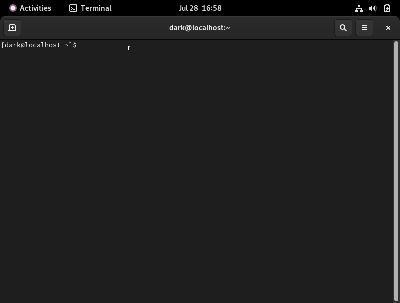

---

### 4. SSH Configuration

Set up secure SSH key-based login from the Ubuntu client for `adminuser` and `devuser`. Password login is disabled for `adminuser` on the CentOS server.

**Commands Executed:**
> **4.1. Generate SSH Keys (on Ubuntu Client)**
> *Description:* Create SSH key pairs on the client machine.
> 
> **4.2. Copy Public Key to CentOS Server (on Ubuntu Client)**
> *Description:* Transfer public keys to the respective user accounts on the server.
> 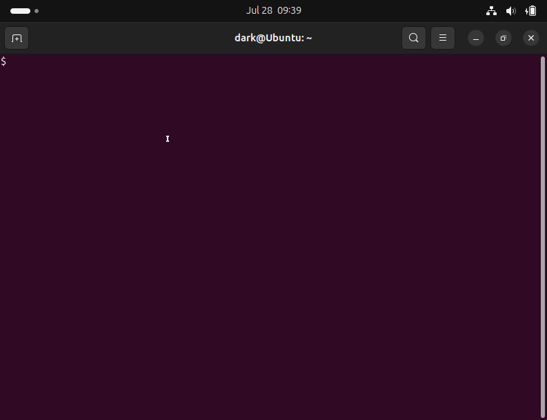
> 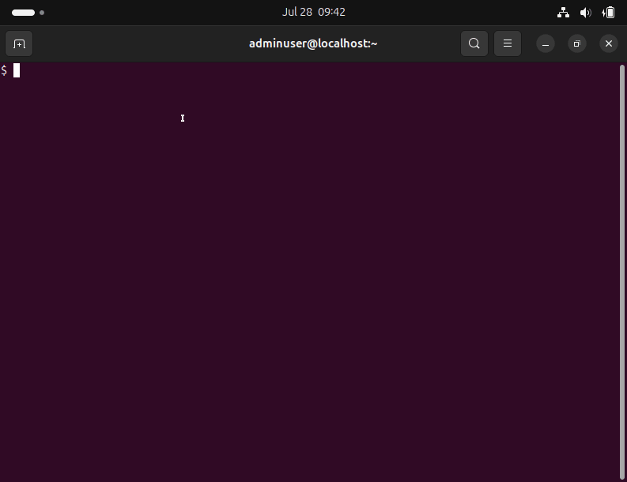
> 
> **4.3. Disable Password Login for `adminuser` (on CentOS Server)**
> *Description:* Modify SSH daemon configuration to enforce key-based authentication for `adminuser`.
> 

---

### 5. Firewall and Network Configuration

Ensure network connectivity and secure the CentOS server by allowing only SSH (port 22) and HTTP (port 80) traffic.

**Commands Executed (on CentOS Server):**
> **5.1. Check `firewalld` Status**
> *Description:* Verify the firewall service is active.
> 
> 
> **5.2. Add Permanent Firewall Rules**
> *Description:* Configure `firewalld` to permanently allow SSH and HTTP ports.
> 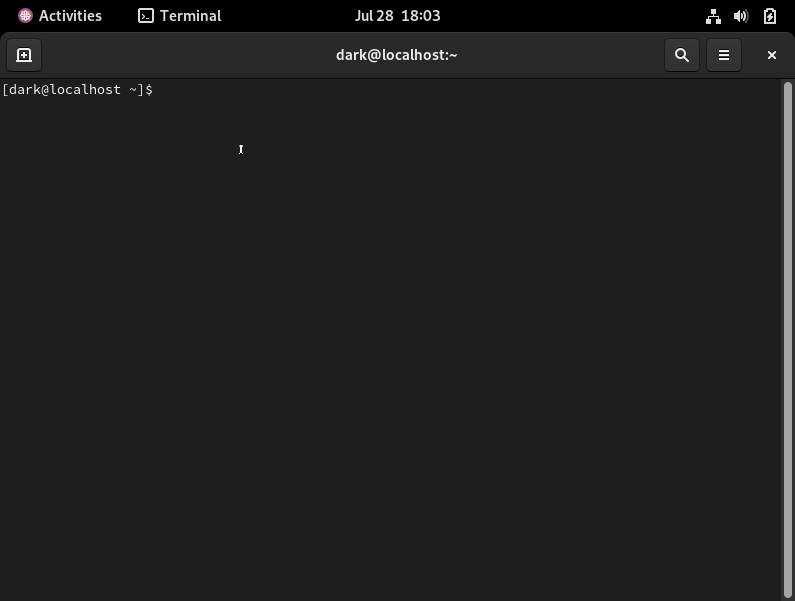
> 
> **5.3. Reload `firewalld` and Verify Rules**
> *Description:* Apply new firewall rules and confirm their active status.
> 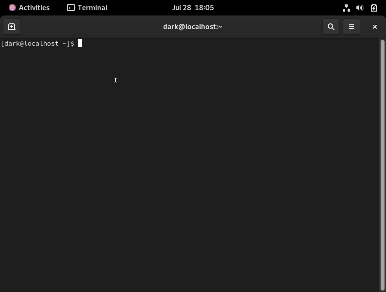

---

### 6. Web Server Deployment

Install Apache HTTP Server (`httpd`) on the CentOS server and verify its accessibility from the Ubuntu client.

**Commands Executed (on CentOS Server):**
> **6.1. Install, Start, and Verify Apache Service**
> *Description:* Install the Apache web server, start it, enable it to run on boot, and confirm its active status.
>
> 
>
> **Verification (on Ubuntu Client):**
> **6.2. Access Web Server from Client**
> *Description:* Use `curl` to confirm the client can access the web server's **default welcome page**.
> *Expected Output:* The default Apache welcome page HTML content.
> 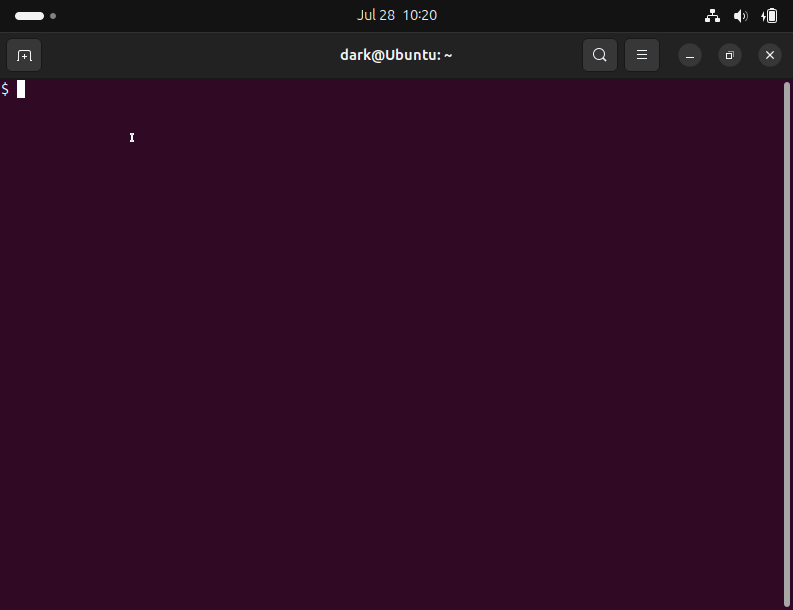

---

### 7. System Monitoring and Logging

Create BASH scripts to monitor CPU and memory utilization, log their status, and run periodically via cron. Logs are stored in `/var/log/monitoring_logs/`.

**Requirements:**
* Two BASH scripts: `cpu_monitoring.sh` and `mem_monitoring.sh`.
* Output format: `"<timestamp> - <STATUS> - <% utilization>"`
* Status thresholds: `OK` (<80%), `WARNING` (≥80% & <90%), `CRITICAL` (≥90%).
* Exit codes: `0` (OK), `1` (WARNING), `2` (CRITICAL).
* Scripts run every **10 minutes** via `cron`.

**Commands Executed (on CentOS Server):**
> #### 7.1. CPU Utilization Monitor Script (`scripts/cpu_monitoring.sh`)
> *Description:* This script calculates CPU utilization, determines status, and logs the result.
> 
> 
> #### 7.2. Memory Utilization Monitor Script (`scripts/mem_monitoring.sh`)
> *Description:* This script calculates memory utilization, determines status, and logs the result.
> 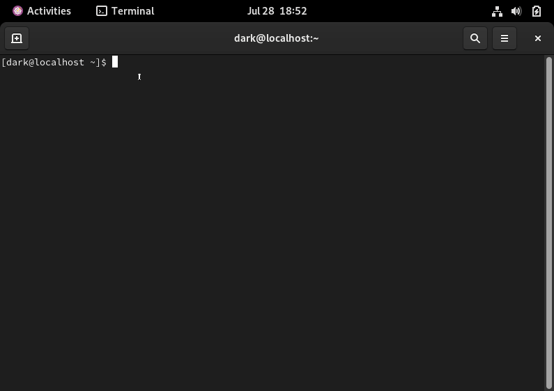
> 
> #### 7.3. Test Monitoring Scripts
> *Description:* Run the scripts to verify their functionality and ensure logs are generated correctly before setting up cron.
> 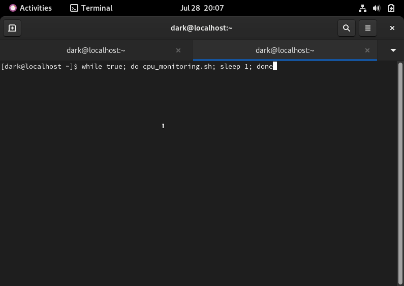
> 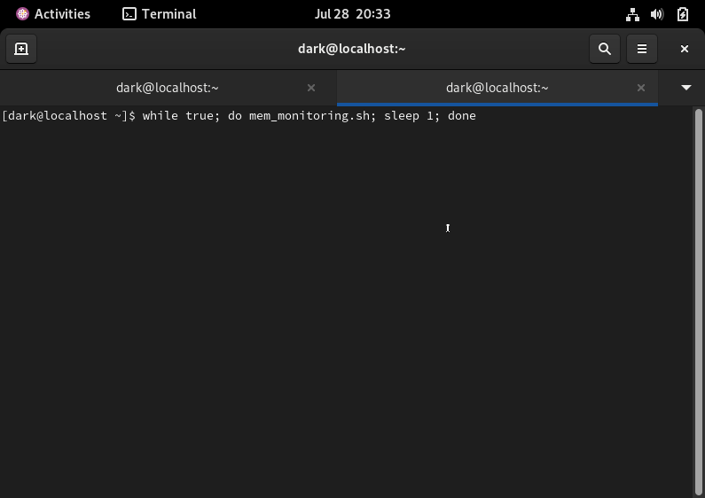
> 
> #### 7.4. Cron Job Setup (on CentOS Server)
> *Description:* Configure `cron` to run the monitoring scripts automatically every 10 minutes as the `root` user.
> 

---

## Recommendations and Best Practices

* **Principle of Least Privilege:** Consider dedicated, unprivileged users for cron jobs with specific `sudo` permissions via `/etc/sudoers.d/`.
* **Robust Log Management:** Implement log rotation (e.g., `logrotate`) to manage log file growth.
* **Alerting Integration:** Integrate monitoring scripts with alerting systems (email, Slack, PagerDuty) for critical status changes.
* **Centralized Logging:** For multi-server environments, forward logs to a centralized solution (ELK Stack, Splunk).
* **Dedicated Monitoring Tools:** Explore advanced tools like Prometheus, Grafana, Nagios, or Zabbix for richer features.
* **SSH Key Passphrases:** Always use strong passphrases for production SSH keys and manage with `ssh-agent`.
* **Firewall Zones:** Utilize `firewalld` zones for more granular network control in complex setups.
* **Idempotent Scripts:** Design configuration scripts to be idempotent for reliable automation.

---

## Files in this Repository

* `README.md`: This comprehensive documentation.
* `scripts/`: Contains the BASH monitoring scripts.
    * [`cpu_monitoring.sh`](./scripts/cpu_monitoring.sh)
    * [`mem_monitoring.sh`](./scripts/mem_monitoring.sh)
* `project-report/`: PDF version

## License

This project is licensed under the [MIT License](LICENSE). See the `LICENSE` file for details.
